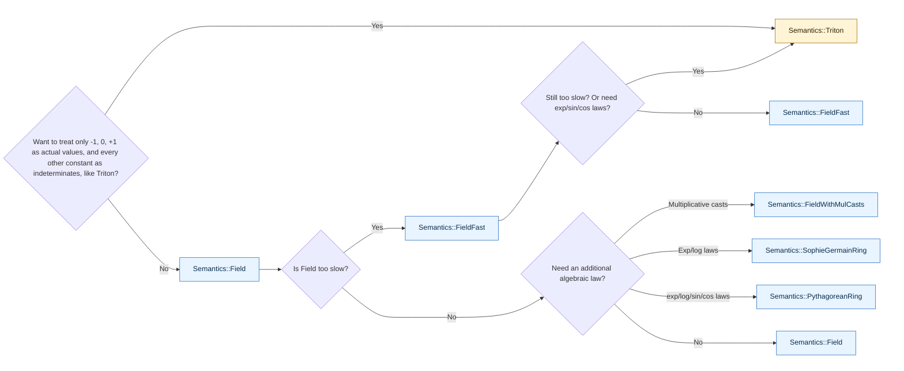

# Algebraic FPSan

This is the basic entryway to algebraic FPSan in `hip-fpsan`. It is for readers
who want to know what the variants are, when to use them, and what behavior to
expect from tests.

For more detail, see:

- [Algebraic FPSan semantics](algebraic-semantics.md): precise operational
  semantics for math-comfortable software engineers.
- [Reducing floats mod p](reducing-floats-mod-p.pdf): the mathematical write-up
  of the construction.
- [Triton FPSan](triton-fpsan.md): background on the original
  Triton-style FPSan idea.

## The short version

`Semantics::Triton` is the original FPSan model: it scrambles each input float
bit pattern into an integer fingerprint, then evaluates arithmetic in a finite ring.
That is excellent for detecting whether two computations have the same symbolic
dataflow up to ring laws such as associativity and distributivity.

The algebraic semantics change the input encoding. Instead of scrambling the float
bits, they encode the exact finite float value as a residue modulo a carefully
chosen finite modulus. The important user-visible effect is:

```cpp
using T = fpsan::Value<float, fpsan::Semantics::Triton,
                       fpsan::Conversions::Explicit>;
using A = fpsan::Value<float, fpsan::Semantics::Field,
                       fpsan::Conversions::Explicit>;

T{2.0f} + T{2.0f} == T{4.0f}; // false: Triton does not preserve this value fact
A{2.0f} + A{2.0f} == A{4.0f}; // true: Field preserves rational value identities
```

In words: the algebraic semantics still give deterministic, reassociation-invariant
fingerprints, but they also preserve identities of the exact unrounded values
inside their supported algebraic fragment.

## Which semantics should I use?

| Use this semantics | When you want | Main tradeoff |
|---|---|---|
| `Semantics::Triton` | Compatibility with the original Triton FPSan model, including its structured `exp`, `exp2`, `sin`, and `cos` fingerprints. | It does not know value facts such as `2 + 2 == 4` or `x + x == 2*x`; infinities and NaNs are just scrambled fingerprints. |
| `Semantics::Field` | The cleanest algebraic model for rational/polynomial code: exact `+ - * /`, no zero-divisors, multiplicative `sqrt`/`cbrt`, and quadratic-residue-based `abs`/selection. | Division and `sqrt`/`cbrt` can be slow; `exp`, `log`, `sin`, and `cos` are opaque tags; mixed-width casts are cheap deterministic conventions, not homomorphisms; comparisons are not IEEE numeric order. |
| `Semantics::FieldFast` | The same primes and finite fingerprints as `Field`, but expensive operations such as division and roots use deterministic tags. | Keeps the core `+ - *` value identities and cheap casts, but gives up `x/x == 1`, multiplicative roots, and field-inverse division. |
| `Semantics::FieldWithMulCasts` | The same Field primes and arithmetic, but with multiplicative casts across the supported width tower, including same-width format changes such as `f16`↔`bf16` and `e4m3`↔`e5m2`. | Casts compute discrete logarithms and can be much slower, especially `f32`↔`f64`. |
| `Semantics::SophieGermainRing` | The algebraic value model plus exact `exp`/`exp2`/`exp10` and `log`/`log2`/`log10` laws, with qr-positive `abs`/selection through the safe-prime CRT factor; checked-in factors make both `2` and `3` positive. | The modulus is composite, so rare zero-divisors exist; casts lose the Field family's optional multiplicative structure. |
| `Semantics::PythagoreanRing` | The Sophie Germain-style exp/log channel plus exact `sin`/`cos` angle-addition identities, with qr-positive `abs`/selection through the `d` CRT factor; checked-in factors make `2` positive. | Slightly more collisions than Sophie Germain, rare zero-divisors, no perfect `cbrt`, `3` is not positive in the composite selected factor, and no multiplicative casts. |
| Any `*2` variant | A second run with different primes under the same design constraints, except that the 8-bit composite modes share the only 2-positive modulus that fits. | Same semantics family, usually a different collision set. Use it to reroll a suspicious equality when the modulus is distinct. |



Blue nodes are algebraic semantics. Yellow nodes are the original
Triton-compatible FPSan semantics. The `*2` variants follow the same decision
tree and are for rerunning against a different collision set.

The semantics are ordinary template parameters, so switching is just a type-alias
change:

```cpp
#include <fpsan/fpsan.hpp>

template <fpsan::Semantics S>
using Scalar = fpsan::Value<float, S, fpsan::Conversions::Explicit>;

using Check = Scalar<fpsan::Semantics::Field>;
```

Compare FPSan-family values only with values from the same semantics. Mixing
different `Value` instantiations in one arithmetic expression is intentionally a
compile-time error.

For hands-on setup, see [authoring code with `Value`](tutorial-authoring.md) for
new code or [porting an existing codebase](tutorial-porting.md) for incremental
adoption.

## What the algebraic semantics do

Every finite binary float is an integer times a power of two. The algebraic
semantics reduce that exact value modulo a finite modulus:

```text
float value:     2^e * m
fingerprint:     2^e * m mod n
```

Because `n` is odd, powers of two are invertible modulo `n`, so negative
exponents are fine. The faithful algebraic semantics then evaluate `+`, `-`, `*`,
and `/` directly on those residues. `FieldFast` keeps the same residue encoding
and the same `+ - *`, but makes division a deterministic tag.

You do not need that math to use the feature. The operational consequences are:

- constant folding and rational identities survive: `2+2 == 4`, `x+x == 2*x`,
  `(a+b)^2 == a^2 + 2ab + b^2`;
- reassociation still survives, as in `Semantics::Triton`;
- the fingerprint is not a recoverable float value, so use `fpsan_payload()` or
  `<fpsan/io.hpp>` for inspection;
- the map is not injective, so false matches are possible, and the `*2` variants
  exist to rerun with an independent collision set.

## Practical workflow

Start the same way you would for Triton FPSan:

```cpp
template <class S>
S reference(const float* x, int n);

template <class S>
S optimized(const float* x, int n);

using Alg = fpsan::Value<float, fpsan::Semantics::Field,
                         fpsan::Conversions::Explicit>;

Alg a = reference<Alg>(ptr, n);
Alg b = optimized<Alg>(ptr, n);
assert(a == b);
```

If a mismatch is surprising, rerun in the nearest `*2` variant:

```cpp
using Alg2 = fpsan::Value<float, fpsan::Semantics::Field2,
                          fpsan::Conversions::Explicit>;
```

If both variants agree that the optimized code changed the fingerprint, it probably
changed the exact algebraic expression. If only one variant reports equality, you
may have hit a finite-modulus collision.

The AMDGPU intrinsic wrappers are generic over `Semantics`. A wrapper that works
for `Semantics::Triton` should normally work for the algebraic semantics without
intrinsic-specific code; the tests use `tests/fpsan_semantics.hpp` to exercise
that contract across all FPSan-family semantics.

## Scorecard

Markers:

- ✅: holds exactly.
- ❌: does not hold.
- ⚠️: supported with the caveat in the row or notes.
- tag: deterministic operation-tagged fingerprint, but no mathematical identity.
- In Performance rows, ✅ is <10x overhead, ⚠️ is 10x or more, and ❌ is
  thousands of x or worse.

| property | Triton | Field | FieldFast | FieldWithMulCasts | Sophie Germain | Pythagorean |
|---|---|---|---|---|---|---|
| **Model** | | | | | | |
| fingerprint source | scramble of IEEE-754 bits | value residue | value residue | value residue | value residue | value residue |
| fingerprint ring | `Z/2^w` | `F_p` | `F_p` | `F_p` | `Z/(p*d)` | `Z/(p*d)` |
| same footprint as the float type | ✅ | ✅ | ✅ | ✅ | ✅ | ✅ |
| second-prime reroll available | N/A | ✅ `Field2` | ✅ `FieldFast2` | ✅ `FieldWithMulCasts2` | ⚠️ `SophieGermainRing2`, shared at 8-bit | ⚠️ `PythagoreanRing2`, shared at 8-bit |
| **Core algebra** | | | | | | |
| deterministic and platform-independent | ✅ | ✅ | ✅ | ✅ | ✅ | ✅ |
| reassociation, commutativity, distributivity | ✅ | ✅ | ✅ | ✅ | ✅ | ✅ |
| input encoding is a value homomorphism | ❌ | ✅ | ✅ | ✅ | ✅ | ✅ |
| exact value identities, e.g. `2+2 == 4` | ❌ | ✅ | ✅ for `+ - *` | ✅ | ✅ | ✅ |
| symbolic value identities, e.g. `x+x == 2*x` | ❌ | ✅ | ✅ | ✅ | ✅ | ✅ |
| `x/x == 1` for nonzero `x` | ❌ about half | ✅ | ❌ tag | ✅ | ⚠️ almost always | ⚠️ almost always |
| no zero-divisors | ❌ many | ✅ | ✅ | ✅ | ⚠️ rare | ⚠️ rare |
| **Casts** | | | | | | |
| casts compose | ✅ | ❌ | ❌ | ✅ | ❌ | ❌ |
| casts are multiplicative | ❌ | ❌ | ❌ | ✅ | ❌ | ❌ |
| **Non-finite values** | | | | | | |
| `1/0` produces a distinguished infinity | ❌ | ✅ | ✅ | ✅ | ✅ | ✅ |
| `1/inf == 0` | ❌ | ✅ | ✅ | ✅ | ✅ | ✅ |
| indeterminate forms produce `NaN` | ❌ | ✅ | ✅ | ✅ | ✅ | ✅ |
| `NaN` is absorbing and deterministic | ❌ | ✅ | ✅ | ✅ | ✅ | ✅ |
| **Order and selection** | | | | | | |
| deterministic comparison, `min`, `max`, and `abs`; not IEEE magnitude order | ✅ signed payload | ✅ qr-positive | ✅ qr-positive | ✅ qr-positive | ✅ qr-positive via selected CRT factor | ✅ qr-positive via selected CRT factor |
| finite nonzero squares are positive | ❌ | ✅ | ✅ | ✅ | ⚠️ units, selected factor | ⚠️ units, selected factor |
| `abs(x) == abs(-x)` for finite nonzero `x` | ❌ | ✅ canonical representative | ✅ canonical representative | ✅ canonical representative | ⚠️ units, selected factor | ⚠️ units, selected factor |
| `abs(x*y) == abs(x)*abs(y)` for finite nonzero `x,y` | ❌ | ✅ | ✅ | ✅ | ⚠️ units, selected factor | ⚠️ units, selected factor |
| `max(positive, non-positive)` selects the positive value | ❌ | ✅ | ✅ | ✅ | ✅ selected factor | ✅ selected factor |
| `2` is positive | ❌ | ⚠️ mixed by width/variant | ⚠️ mixed by width/variant | ⚠️ mixed by width/variant | ✅ | ✅ |
| `3` is positive | ❌ | ✅ | ✅ | ✅ | ✅ | ❌ forced non-residue |
| **Roots** | | | | | | |
| `sqrt(x*y) == sqrt(x)*sqrt(y)` | ❌ tag | ✅ | ❌ tag | ✅ | ✅ | ✅ |
| `rsqrt == 1/sqrt` | ❌ tag | ✅ | ❌ tag | ✅ | ✅ | ✅ |
| `sqrt(x)^2 == x` | ❌ tag | ⚠️ half: square residues | ❌ tag | ⚠️ half: square residues | ⚠️ half per factor: square residues | ⚠️ half per factor: square residues |
| perfect multiplicative `cbrt` | ❌ tag | ✅ | ❌ tag | ✅ | ✅ | ❌ tag |
| **Exp/log/trig** | | | | | | |
| `exp(a+b) == exp(a)*exp(b)` | ✅ | ❌ tag | ❌ tag | ❌ tag | ✅ | ✅ |
| `exp2(a+b) == exp2(a)*exp2(b)` | ✅ | ❌ tag | ❌ tag | ❌ tag | ✅ | ✅ |
| `exp10(a+b) == exp10(a)*exp10(b)` | ❌ tag | ❌ tag | ❌ tag | ❌ tag | ✅ | ✅ |
| `log(x*y) == log(x)+log(y)` | ❌ tag | ❌ tag | ❌ tag | ❌ tag | ✅ | ✅ |
| `log2(x*y) == log2(x)+log2(y)` | ❌ tag | ❌ tag | ❌ tag | ❌ tag | ✅ | ✅ |
| `log10(x*y) == log10(x)+log10(y)` | ❌ tag | ❌ tag | ❌ tag | ❌ tag | ✅ | ✅ |
| `exp(log(exp(x))) == exp(x)` | ❌ tag | ❌ tag | ❌ tag | ❌ tag | ✅ | ✅ |
| `sin`/`cos` angle-addition formulas | ✅ | ❌ tag | ❌ tag | ❌ tag | ❌ tag | ✅ |
| `cos(x)^2 + sin(x)^2 == 1` | ✅ | ❌ tag | ❌ tag | ❌ tag | ❌ tag | ✅ |
| `erf`, `tanh`, `floor`, `ceil`, unmodeled externs | tag | tag | tag | tag | tag | tag |
| **Performance overhead**, lower is better; relative to native; measured on x86 CPU and AMD RDNA4 | | | | | | |
| f32 `+ - *` hot loops | ✅ ~1x | ✅ <10x | ✅ <10x | ✅ <10x | ✅ <10x | ✅ <10x |
| f32 division hot loops | ✅ <10x | ✅ <10x | ✅ <10x tag | ✅ <10x | ✅ <10x | ✅ <10x |
| f32 `sqrt` hot loops | ✅ <10x tag | ⚠️ 10-100x | ✅ <10x tag | ⚠️ 10-100x | ⚠️ 10-100x | ⚠️ 10-100x |
| fp8/f16↔f32 casts | ✅ <10x | ✅ <10x | ✅ <10x | ❌ CPU ~100x<br>RDNA4 ~10,000x | ✅ <10x | ✅ <10x |
| f32↔f64 casts | ✅ <10x | ✅ <10x | ✅ <10x | ❌ CPU ~10,000x<br>RDNA4 ~100,000x | ✅ <10x | ✅ <10x |

Notes:

- Triton division only has a true inverse on odd integer fingerprints, so
  `x/x == 1` succeeds for roughly half of inputs and does not hold as a
  semantic law.
- `SophieGermainRing` and `PythagoreanRing` are rings, not fields. A rare
  zero-divisor makes division poison to `NaN`; ordinary unit values divide
  exactly.
- `Semantics::Field`, `Semantics::FieldFast`, and
  `Semantics::FieldWithMulCasts` use the same primes and therefore
  the same finite fingerprints for input values. `FieldFast` differs in
  division and roots; `FieldWithMulCasts` differs in casts.
- Algebraic qr-order comparisons and `min`/`max` do not model magnitude. They
  split finite nonzero residues into quadratic residues and non-residues,
  treating the qr half as "positive"; zero, infinity, NaN, and non-residues are
  not qr-positive. Field-family semantics use their prime field. Sophie Germain
  rings use the safe-prime CRT factor `p = n/d`. Pythagorean rings use the `d`
  CRT factor, checked in as `d == 7 mod 24`. This is deliberately not a test for being a
  square in every CRT factor. Strict `<` is true only from the non-positive
  class to the qr-positive class, while `<=` is its reflexive preorder
  (`!(b < a)`). Thus `0 <= n` and `n <= 0` both hold for a finite non-residue
  `n`, but neither is strictly less than the other. `abs(x)` returns the
  canonical qr representative of `{x, -x}` when the selected factor is nonzero.
  In the Field family this covers every finite nonzero value. In composite
  rings it covers the ordinary unit case; finite zero-divisors whose selected
  factor is zero lie in the non-positive class and do not have a canonical sign
  through that factor. Within the selected-factor unit case, finite nonzero
  squares are qr-positive and `abs` is multiplicative. This is useful for
  algebraic sign choices and nonzero pivot/norm selection in rank-revealing
  code, but it is still only deterministic fingerprint order.
- The checked-in composite moduli intentionally make `2` qr-positive in the
  selected factor. Sophie Germain choices also make `3` qr-positive. Pythagorean
  composite choices cannot do both: with `p = 4*d + 1` prime, `d` is forced to
  make `3` a selected-factor non-residue. This small-prime behavior is one place
  where the composite families are more tuned than the Field-family primes,
  whose stronger cast/root constraints leave `2` mixed across widths and
  variants.
- Performance rows are order-of-magnitude summaries from the checked-in
  microbenchmarks. Exact factors still vary by target.
- `Semantics::FieldWithMulCasts` casts are the expensive outlier because they
  are multiplicative homomorphisms and therefore compute discrete logarithms.
  They also distinguish same-bit-width format changes such as `f16`↔`bf16` and
  `e4m3`↔`e5m2`. Triton casts, `Semantics::Field`/`FieldFast` casts, and the
  composite algebraic casts are cheap integer conventions.
- Core `+ - *` arithmetic remains under 10x native in the microbenchmarks.
  Faithful division is also under 10x; faithful algebraic roots cost tens of x.
- `sqrt` is multiplicative in the faithful algebraic semantics. `FieldFast` makes it
  a tag; in the other algebraic semantics, the stronger round trip
  `sqrt(x)^2 == x` holds on square residues. That is about half of a prime
  field; in the composite ring modes the condition is componentwise.
- `tag` means the function is still deterministic and operation-distinguishing.
  It simply does not claim an identity such as `log(x*y) == log(x)+log(y)`.

## Limits to keep in mind

Algebraic FPSan is still a fingerprinting tool, not a replacement floating-point
implementation.

- It checks exact algebraic equivalence, not IEEE-754 rounding behavior.
- It intentionally ignores overflow magnitude. A finite algebraic sum remains a
  finite residue; infinity comes from division by true zero.
- Its comparisons, `min`, `max`, and `abs` are fingerprint operations, not
  IEEE-754 magnitude/order operations. The checked-in algebraic modulus tables
  use the qr-positive convention above.
- Algebraic fingerprints do not decode back to useful floats. `to_float()` is
  deliberately unavailable in algebraic semantics.
- Collisions are possible because a fixed-width residue cannot injectively
  encode every finite float value. Rerun with a `*2` variant when that matters.
